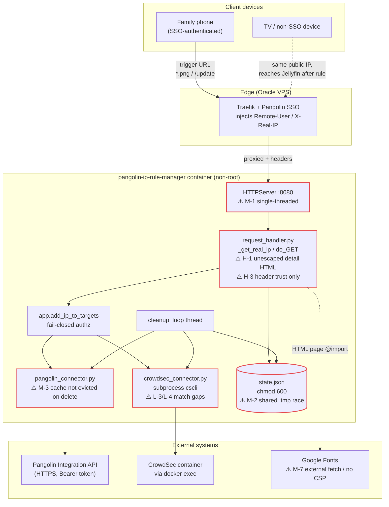

# Codebase Analysis & Remediation Plan — `pangolin-ip-rule-manager`

**Audit date:** 2026-07-01
**Audited revision:** `claude/security-code-audit-yhi1vt` (HEAD `0356504`)
**Scope:** Full repository — application code, connectors, templates, container build, CI/CD, and configuration.

---

## 1. Executive summary

`pangolin-ip-rule-manager` is a small, focused Python 3.14 stdlib-only service that bootstraps
network trust for non-SSO devices by writing temporary IP bypass rules into Pangolin (and
optionally a CrowdSec allowlist). Overall the project is in **good health for its size**:

- **Test coverage is strong** — 185 tests pass, covering the authorization chain, fail-closed
  behaviour, retry/backoff, state round-trips, and the CrowdSec parsing helpers.
- **Linting is clean** — `ruff check .` and `ruff format --check .` both pass.
- **Security fundamentals are mostly right** — fail-closed authorization, HTTPS enforcement on
  the Pangolin URL, `subprocess.run` with argument lists (no `shell=True`), IP and allowlist-name
  validation, token redaction helper, atomic-ish state writes with `chmod 600`, non-root container
  user, and SHA-pinned GitHub Actions.

The issues found are concentrated in three areas: **(a) trust-boundary assumptions** around
forwarded headers, **(b) a reflected-XSS gap** in the check-in page details, and **(c) infrastructure
drift** — a `:latest` image tag that is referenced but never published, and missing `pip` Dependabot
coverage. None of the findings indicate an actively exploited hole, but the XSS gap and the
header-trust model are the two that warrant prompt attention because this service gates access to
production resources.

**Severity tally:** Critical 0 · High 3 · Medium 7 · Low 6

> **Process note (per `CLAUDE.md`):** changes touching IP extraction, the authorization chain,
> TTL/cleanup logic, or Pangolin/CrowdSec calls must be validated against the test instance before
> production, and each concern should land as its own PR with a single release-notes label. This
> plan groups fixes by concern to make that split straightforward.

---

## 2. Prioritized findings

### Severity legend
- **Critical** — remote compromise / auth bypass / data loss, exploitable as shipped.
- **High** — security weakness or reliability defect with a realistic trigger in this deployment.
- **Medium** — hardening gap, correctness bug with limited blast radius, or notable infra drift.
- **Low** — quality, maintainability, and defense-in-depth improvements.

---

## HIGH

### H-1 — Reflected XSS via unescaped detail strings in the check-in page
- **Files / lines:** `request_handler.py:174-176` (`PANGOLIN_DETAIL`, `CROWDSEC_DETAIL`),
  `request_handler.py:155` and `request_handler.py:184` (`site_name` in `SITE_NAME_SUB`),
  `_build_checkin_html` / `_build_error_html`.
- **Claim:** `_load_template` does a blind `str.replace` of `{{TOKEN}}` with the provided value
  (`request_handler.py:22-27`). Most tokens are static, but `PANGOLIN_DETAIL` and `CROWDSEC_DETAIL`
  carry `results[...]["detail"]`, which is exception text from the upstream API path — it can include
  the raw HTTP error body returned by Pangolin (`http_json` at `app.py:162-167`) and the
  `Remote-User` value (`pangolin_connector.py` messages embed `username!r}`). None of these are run
  through `html.escape` before interpolation.
- **Failure scenario:** A Pangolin/upstream error message (or a crafted `Remote-User`) containing
  `` is reflected verbatim into the details `<span>` and executes in the
  visitor's browser. The `/update` error path already escapes `raw_ip` (`request_handler.py:321`),
  and `CLAUDE.md` explicitly calls out that user-controlled strings must be `html.escape()`d — this
  path was missed.
- **Fix:** Escape every dynamic value at the interpolation boundary. Minimal, targeted change:

```python
# request_handler.py — inside _build_checkin_html, before building the tokens dict
import html  # already imported at top

safe_pangolin_detail = html.escape(str(pangolin_detail))
safe_crowdsec_detail = html.escape(str(crowdsec_detail_display))
# ...
        {
            # ...
            "PANGOLIN_DETAIL": safe_pangolin_detail,
            "CROWDSEC_DETAIL": safe_crowdsec_detail,
            # ...
        },
```

```python
# request_handler.py — _build_checkin_html and _build_error_html
site_name_sub = (
    f'      <div class="sub">{html.escape(site_name)}</div>\n' if site_name else ""
)
# and in _build_error_html:
site_name_footer = f"{html.escape(site_name)} &nbsp;&middot;&nbsp; " if site_name else ""
```
  A stronger structural fix is to make `_load_template` escape by default and require callers to
  opt out for pre-built HTML fragments (`ACTIONS_SECTION`, `BOOKMARK_SECTION`), but the targeted
  escapes above close the hole with minimal risk. Add a regression test that feeds
  `detail = '<script>alert(1)</script>'` and asserts the rendered body contains the escaped form.
- **Validation:** unit test + manual check against the test instance (touches HTML rendering only,
  not the auth chain).

### H-2 — `:latest` image tag is referenced but never published (registry/release drift)
- **Files / lines:** `docker-compose.yml:3` (`image: ghcr.io/...:latest`) vs
  `.github/workflows/docker-publish.yml:33-34` (`tags: type=semver,pattern={{version}}` only).
- **Claim:** The publish workflow only emits a version tag (e.g. `2.3.0`). No step ever pushes or
  moves a `latest` tag. The reference `docker-compose.yml` — the documented deployment artifact —
  pulls `:latest`. There is therefore no guarantee the tag resolves to any build produced by this
  pipeline; whatever `:latest` currently points to on GHCR is unverified against release assets.
- **Failure scenario:** An operator does `docker compose pull` expecting the newest release and
  either gets an image that predates the pipeline's tagging scheme, a stale manual push, or a pull
  failure. Because there's no staging (`CLAUDE.md` / D7), this surfaces directly in production.
- **Fix (choose one):**
  1. **Publish `latest` in CI** (recommended) — add it to the metadata step so releases move the tag:
```yaml
# .github/workflows/docker-publish.yml
      - name: Extract metadata for Docker
        id: meta
        uses: docker/metadata-action@80c7e94dd9b9319bd5eb7a0e0fe9291e23a2a2e9 #v6.1.0
        with:
          images: ghcr.io/joe-cole1/pangolin-ip-rule-manager
          tags: |
            type=semver,pattern={{version}}
            type=raw,value=latest,enable={{is_default_branch}}
```
  2. **Or pin compose to versions** — change `docker-compose.yml:3` to a specific tag
     (`:2.3.0`) and document bumping it per release. This is the safer supply-chain posture
     (immutable, auditable deploys) and fits the "every change is high-stakes" constraint.
- **Validation:** cut a test release/tag and confirm both `:<version>` and (if option 1) `:latest`
  resolve to the same digest; verify `docker compose pull` succeeds.

### H-3 — Trust in forwarded identity headers has no cryptographic anchor
- **Files / lines:** `request_handler.py:242-254` (`_get_real_ip` trusts `X-Real-IP`/`X-Forwarded-For`),
  `request_handler.py:282` (`Remote-User` read directly), authorization chain `app.py:246-320`.
- **Claim:** Authorization keys entirely off the `Remote-User` header and the client IP off
  `X-Real-IP`/`X-Forwarded-For`. The service assumes these can only be set by the upstream
  Pangolin/Traefik proxy. There is no shared-secret / signed-header check verifying the request
  actually transited that proxy. The tests at `tests/test_app.py:976-1024` document that a former
  `EXPECTED_PANGOLIN_CUSTOM_HEADER_*` gate was **removed**, so the only remaining barrier is network
  topology.
- **Failure scenario:** If the container port (`0.0.0.0:8080`, `app.py:576`) is ever reachable
  without going through Pangolin — a misconfigured Docker network, an exposed port, an SSRF pivot
  from a co-located container — an attacker sets `Remote-User: <any valid org user>` and
  `X-Forwarded-For: <attacker IP>` and self-authorizes an IP bypass rule for protected resources.
  The fail-closed logic does not help here because the attacker supplies a *valid* username.
- **Fix:** Re-introduce a defense-in-depth shared secret that only the proxy knows, checked before
  any state write or API fan-out. Keep it optional-but-warned to avoid breaking existing deploys,
  mirroring the existing token-missing warning pattern:
```python
# app.py (config)
PROXY_SHARED_SECRET = os.getenv("PROXY_SHARED_SECRET", "")

# request_handler.py, at the very top of do_GET, before any state mutation:
expected = ctx.get("proxy_shared_secret", "")
if expected:
    import hmac
    provided = self.headers.get("X-Proxy-Secret", "")
    if not hmac.compare_digest(provided, expected):
        self.send_response(403); self.end_headers()
        self.wfile.write(b"Forbidden")
        return
```
  Configure Traefik/Pangolin to inject `X-Proxy-Secret` (and strip any client-supplied copy).
  Document that the container must never be published directly. Also confirm the proxy strips
  inbound `Remote-User`/`X-Real-IP` from clients so they cannot be spoofed end-to-end.
- **Validation:** touches the authorization chain and IP extraction — **must** be validated against
  the test instance before production, per `CLAUDE.md`. Add tests for present/absent/wrong secret.

---

## MEDIUM

### M-1 — Single-threaded server blocks all traffic on slow upstream calls
- **Files / lines:** `app.py:577` (`HTTPServer`), upstream calls with 20s timeout ×3 retries
  (`app.py:155`, `pangolin_connector.py:11-33`).
- **Claim:** `http.server.HTTPServer` is single-threaded. Each check-in can trigger multiple
  Pangolin GET/PUT calls, each up to 20s with up to 3 retries and exponential backoff. One slow or
  hanging upstream stalls every other request, including health checks.
- **Fix:** Use a threaded server:
```python
from http.server import ThreadingHTTPServer
httpd = ThreadingHTTPServer(addr, ImageRequestHandler)
```
  Note the shared caches (`rules_cache`, `_api_rate_limit`, CrowdSec cache) are already guarded by
  locks, so threading is safe. Verify the state file write path (see M-2) under concurrency.
- **Validation:** reliability change; run the suite and a concurrent-request smoke test.

### M-2 — `save_state` uses a single shared temp path — concurrent writers race
- **Files / lines:** `app.py:131-141` (`tmp_file = STATE_FILE + ".tmp"`).
- **Claim:** The cleanup thread and request handlers both call `save_state`. All writers use the
  same `state.json.tmp` path, so two concurrent writes can interleave and `os.replace` a partial or
  wrong-writer file. Becomes materially more likely if M-1 (threading) is adopted.
- **Fix:** Serialize saves with a dedicated lock and/or a unique temp name:
```python
_save_lock = threading.Lock()

def save_state():
    with _save_lock:
        with state_lock:
            snapshot = json.dumps(state, indent=2, sort_keys=True)
        fd, tmp_file = tempfile.mkstemp(dir=os.path.dirname(os.path.abspath(STATE_FILE)))
        try:
            with os.fdopen(fd, "w", encoding="utf-8") as f:
                f.write(snapshot)
            os.replace(tmp_file, STATE_FILE)
            os.chmod(STATE_FILE, 0o600)
        except Exception as e:
            print(f"[state] failed to save state: {e}")
            with contextlib.suppress(OSError):
                os.remove(tmp_file)
```
- **Validation:** touches state persistence; run state round-trip tests + concurrency smoke test.

### M-3 — Rule cache not invalidated after deletion → stale "rule exists" reads
- **Files / lines:** `pangolin_connector.py:147-190` (`delete_ip_rule_if_created_by_us` never touches
  `ctx.rules_cache`), consumed by `get_ip_set_for_resource_cached` (`pangolin_connector.py:53-84`).
- **Claim:** On creation the code updates `rules_cache` (`pangolin_connector.py:124-129`), but on
  deletion it does not remove the IP. For up to `RULES_CACHE_TTL_SECONDS` (1h default) after cleanup
  deletes a rule, a re-check-in from the same IP sees the cached entry, logs "rule already exists",
  and skips re-creation — leaving the user without access until the cache expires.
- **Fix:** Invalidate the cached IP on successful delete:
```python
# after a successful DELETE in delete_ip_rule_if_created_by_us:
with ctx.state_lock:
    entry = ctx.rules_cache.get(rid)
    if entry and ip in entry.get("ip_set", set()):
        entry["ip_set"].discard(ip)
```
- **Validation:** touches TTL/cache + Pangolin API logic; add a test asserting cache eviction on
  delete; validate against test instance.

### M-4 — `pip` ecosystem missing from Dependabot (coverage regression)
- **Files / lines:** `.github/dependabot.yml:1-11` (only `github-actions` + `docker`).
- **Claim:** `requirements.txt` pins `pytest` and `ruff`, and the git history shows past pip
  Dependabot PRs (e.g. `pip/pip-590e9db7b9` in `git log`). The current config has no `pip` entry, so
  those dev dependencies no longer receive security/version updates automatically.
- **Fix:**
```yaml
  - package-ecosystem: "pip"
    directory: "/"
    schedule:
      interval: "weekly"
```
- **Validation:** config only; confirm Dependabot picks up `requirements.txt` after merge.

### M-5 — `redact_headers_for_log` is dead code; request logging is not actually redacted
- **Files / lines:** `app.py:103-115` (defined), `app.py:441` (injected into ctx), never invoked in
  `request_handler.py`. Request logging is `print(f"New request from {ip}  user: {remote_user} ...")`
  (`request_handler.py:284`) and `log_message` (`request_handler.py:218-219`).
- **Claim:** The redaction helper is fully tested but never called on a real request path. It gives
  a false sense that sensitive headers are scrubbed from logs; in practice no header dump is logged
  at all, and the helper is drift-prone dead code.
- **Fix:** Either wire it into an actual (debug-gated) header dump, or remove it and its tests if
  header logging is intentionally absent. If kept, call it where headers would be logged:
```python
if DEBUG_HEADERS:
    print("[http] headers:", ctx["redact_headers_for_log"](dict(self.headers)))
```
- **Validation:** low-risk; keep the existing unit tests if the function is retained.

### M-6 — Container and compose lack runtime hardening flags
- **Files / lines:** `Dockerfile:1` (`FROM python:3.14-alpine`, tag not digest-pinned),
  `docker-compose.yml:1-90` (no `security_opt`, `cap_drop`, `read_only`, `tmpfs`).
- **Claim:** The image runs as non-root (good) but the base is not digest-pinned (supply-chain
  drift), and the compose service does not drop capabilities, set `no-new-privileges`, or mount the
  root FS read-only. `docker-cli` is installed unconditionally even when CrowdSec is disabled,
  widening the attack surface.
- **Fix:**
  - Pin the base image by digest: `FROM python:3.14-alpine@sha256:...`.
  - Add to the compose service:
```yaml
    security_opt:
      - no-new-privileges:true
    cap_drop:
      - ALL
    read_only: true
    tmpfs:
      - /tmp
```
    (Keep the `/data` volume writable for state.)
  - Consider a build arg to skip `docker-cli` when CrowdSec integration is not used.
- **Validation:** rebuild image, run container, confirm state writes and (if enabled) CrowdSec exec
  still work under the hardened flags.

### M-7 — No Content-Security-Policy; templates fetch external Google Fonts
- **Files / lines:** `request_handler.py:260-262` (`_send_security_headers` sets only
  `X-Content-Type-Options` and `X-Frame-Options`), `templates/checkin.html:8` and
  `templates/error.html:8` (`@import url('https://fonts.googleapis.com/...')`).
- **Claim:** There is no CSP header, so the XSS in H-1 has no second line of defense. The templates
  also pull fonts from Google, leaking each visitor's IP/User-Agent to a third party and adding an
  external dependency for pages served to authenticate access.
- **Fix:** Add a restrictive CSP and self-host or drop the web fonts:
```python
def _send_security_headers(self) -> None:
    self.send_header("X-Content-Type-Options", "nosniff")
    self.send_header("X-Frame-Options", "DENY")
    self.send_header("Referrer-Policy", "no-referrer")
    self.send_header(
        "Content-Security-Policy",
        "default-src 'none'; style-src 'self' 'unsafe-inline'; img-src 'self' data:; "
        "script-src 'unsafe-inline'; base-uri 'none'; form-action 'none'",
    )
```
  Note the inline `<script>`/`<style>` in the templates require `'unsafe-inline'` unless refactored
  to hashed/nonce'd blocks; removing the Google Fonts `@import` lets you drop `fonts.googleapis.com`
  from the policy entirely. Pair this with H-1 for meaningful protection.
- **Validation:** render both pages, confirm styling/scripts still work with the CSP applied.

---

## LOW

### L-1 — Duplicated CrowdSec config/state between `app.py` and `crowdsec_connector.py`
- **Files / lines:** `app.py:44-59` and `app.py:89-92` re-parse `CROWDSEC_*` env vars and declare
  `_crowdsec_allowlist_ready` / `crowdsec_cache`, which duplicate/shadow the authoritative copies in
  `crowdsec_connector.py:12-28`. The app-level `crowdsec_cache` and `_crowdsec_allowlist_ready` are
  never read by the connector.
- **Fix:** Delete the unused app-level CrowdSec globals; keep only what `app.py` genuinely needs
  (`CROWDSEC_ENABLED` for `TARGETS` registration and self-check display). Import the rest from the
  connector if needed.

### L-2 — `Target` polymorphism undercut by `isinstance` branching
- **Files / lines:** `app.py:296-302` (`isinstance(t, PangolinTarget/CrowdSecTarget)`),
  `app.py:188` (`PangolinTarget.add_ip` has an extra `resource_ids` param the base class lacks).
- **Fix:** Give `Target.add_ip(ip, context)` a uniform signature (pass effective resource IDs to all
  targets; CrowdSec ignores them), so `add_ip_to_targets` can loop without type checks. Reduces the
  chance of a future target being mis-handled.

### L-3 — CrowdSec allowlist existence check uses substring match
- **Files / lines:** `crowdsec_connector.py:194-198` (`if name in out3`).
- **Fix:** The JSON paths are exact; the plain-text fallback should match a whole token/line rather
  than a substring, so an allowlist named `pang` doesn't false-match `pangolin-ip-rule-manager`.
  Prefer failing to the JSON path or line-splitting and comparing trimmed tokens.

### L-4 — CrowdSec CIDR entries collapse to the network address only
- **Files / lines:** `crowdsec_connector.py:261-285` (`_parse_crowdsec_entries_from_json` stores
  `str(net.network_address)`).
- **Fix:** Membership checks (`_crowdsec_ip_known_or_refresh`, `crowdsec_remove_ip`) compare exact
  IP strings, so an IP inside an existing CIDR allowlist entry is treated as "not present" and
  re-added. If CIDR entries are expected, store the network objects and test containment; otherwise
  document that only exact-IP entries are managed.

### L-5 — HEALTHCHECK only proves the process is alive, not that it serves
- **Files / lines:** `Dockerfile:34-35` and `docker-compose.yml:85-90` (`pgrep -f app.py`).
- **Fix:** A hung single-threaded server (see M-1) still passes `pgrep`. Add a lightweight HTTP
  liveness route (e.g. `/healthz` returning 200 without touching Pangolin) and healthcheck against
  it, or curl a known `.png` path. Keep it cheap so it doesn't trigger auth/API work.

### L-6 — Missing repo hygiene files: LICENSE, SECURITY.md, pyproject.toml
- **Files / lines:** repository root (none present).
- **Fix:** Add a LICENSE (clarifies reuse terms for a public GHCR image), a SECURITY.md with a
  disclosure contact, and a `pyproject.toml` to pin the ruff config/target-version explicitly rather
  than relying on ruff defaults across contributor environments.

---

## 3. Suggested PR sequencing (one concern per PR, per `CLAUDE.md`)

| Order | Concern | Findings | Suggested label |
|---|---|---|---|
| 1 | Escape XSS in check-in/error pages | H-1 | `security` |
| 2 | Fix `:latest` publish/pin drift | H-2 | `bug` / `security` |
| 3 | Shared-secret proxy header check | H-3 | `security` |
| 4 | Threaded server + safe state writes | M-1, M-2 | `bug` |
| 5 | Rule-cache invalidation on delete | M-3 | `bug` |
| 6 | Add pip Dependabot ecosystem | M-4 | `dependencies` |
| 7 | Container/compose hardening + CSP | M-6, M-7 | `security` |
| 8 | Cleanup: dead code, polymorphism, hygiene | L-1..L-6, M-5 | `chore` |

Items 3, 4, and 5 touch the auth chain / TTL / API interactions and **must be validated against the
test instance** before production, per the project's behavioral rules.

---

## 4. Architecture diagram (current state + improvement points)



**Where structural improvement pays off most:**
1. **Trust boundary (`traefik → server`, H-3):** add a shared-secret header verified before any
   state write or API call, so the container is safe even if its port is exposed.
2. **Presentation layer (H-1, M-7):** escape-by-default templating + a CSP turns the check-in page
   from a reflected-XSS surface into a hardened, self-contained page.
3. **Concurrency & persistence (M-1, M-2):** a threaded server with serialized, uniquely-named state
   writes removes the head-of-line blocking and the temp-file race in one coherent change.
4. **Cache coherence (M-3):** invalidating `rules_cache` on delete keeps in-memory state, on-disk
   state, and Pangolin's actual rules aligned across the create/cleanup cycle.
5. **Supply chain (H-2, M-4, M-6):** publish/pin image tags deterministically, restore pip
   Dependabot, and digest-pin + harden the container to make production deploys auditable.
